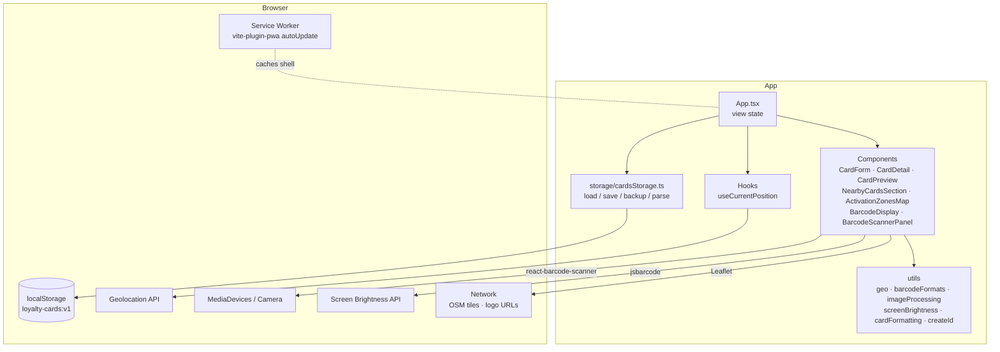
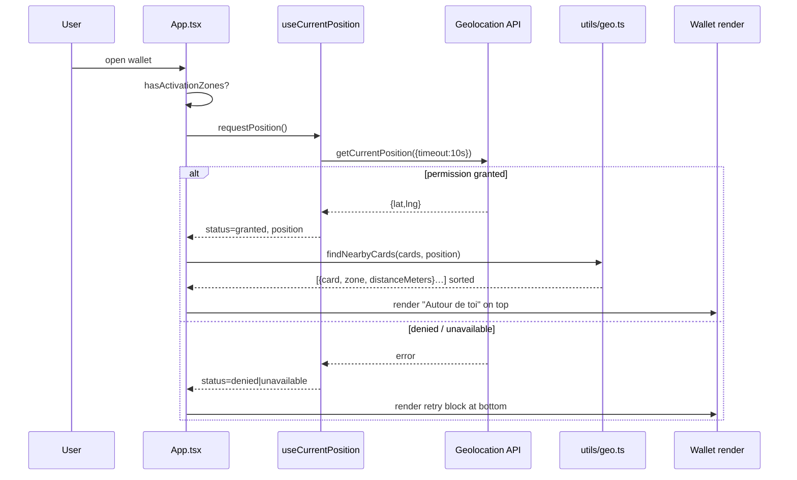

# Architecture

A deliberately small React SPA, served at the site root, with all persistence
in the browser and all integrations through standard Web APIs.

## High-level layers

## Runtime shape

- **Single SPA, no router library.** `App.tsx` holds a `View` discriminated
  union (`wallet | add | edit | detail | settings`) in `useState`. Navigation
  is just a state transition. That keeps the bundle smaller and the logic
  traceable, and costs nothing since there are no deep-link URLs to preserve.
- **State is ephemeral; storage is the source of truth on load.** `App.tsx`
  calls `loadCards()` once on mount, mutates an in-memory array for the
  session, and writes back through `saveCards()` after every change. No
  optimistic concurrency problems because nothing else writes the same key.
- **Hooks for browser APIs.** `useCurrentPosition` wraps `navigator.geolocation`
  with a state machine (`idle → checking → granted | denied | unavailable |
  unsupported`). Other APIs (brightness, camera) are invoked directly from the
  components that need them.

## Nearby-cards flow

The most interesting end-to-end path. When the user opens the wallet and has at
least one card with zones attached:

`findNearbyCards` iterates every card's zones, keeps the closest zone whose
distance is within its `radiusMeters`, and sorts the surviving matches by
distance. All of this is local, synchronous, and O(cards × zones).

## Persistence strategy

- **`localStorage` key `loyalty-cards:v1`.** Full array of `LoyaltyCard`
  objects, JSON-serialised. See [data-model.md](./data-model.md).
- **Defensive deserialisation.** `loadCards()` parses the JSON, discards
  non-array payloads, and filters through a per-card validator (`isCard`). A
  corrupted or partially-migrated entry is silently dropped rather than
  crashing the app. Historically, this has meant users can evolve the schema
  additively without data loss.
- **Backups export with icons inlined** under a separate `icons` array linked
  by id, so the JSON stays small when the same logo appears on multiple cards
  and, more importantly, so rejecting an invalid backup leaves the wallet
  untouched.

## Progressive enhancement matrix

| Capability           | Required? | If missing                               |
|----------------------|-----------|------------------------------------------|
| `localStorage`       | yes       | App runs but saves fail with a message   |
| Geolocation API      | no        | Nearby section hidden; manual use only   |
| Camera / MediaDevices| no        | Scanner button shows an inline error     |
| Screen Brightness    | no        | Barcode displays at ambient brightness; result memoised |
| Service Worker       | no        | App still runs; no offline shell         |
| OSM tile network     | no        | Map renders a placeholder, zone data still saves |

This matrix is enforced in code by feature detection, not UA sniffing.

## Build & deployment

- **Vite 5** produces a static bundle under `dist/`. The base path is `/`
  (see `vite.config.ts`); change it only if the app needs to be mounted under
  a sub-path on the host.
- **`vite-plugin-pwa`** generates the manifest and service worker. Registration
  type is `autoUpdate` — a new SW takes over on the next load without
  prompting.
- **Custom Vite condition `zbar-inlined`** is set in `resolve.conditions` and
  `optimizeDeps.esbuildOptions.conditions` so that `react-barcode-scanner`
  ships `zbar-wasm` inline rather than fetching it from a CDN at runtime.
  Offline-install friendliness is the payoff.

## Testing topology

Vitest with `happy-dom` as the DOM implementation. Integration tests in
`src/App.test.tsx` exercise whole flows (add card → edit → delete, nearby
filtering, backup/restore), with browser APIs stubbed on `globalThis` from
`src/test/setup.ts`. Small utils (geo, barcode formats, image processing, card
formatting, screen brightness) have focused unit tests that avoid React.
