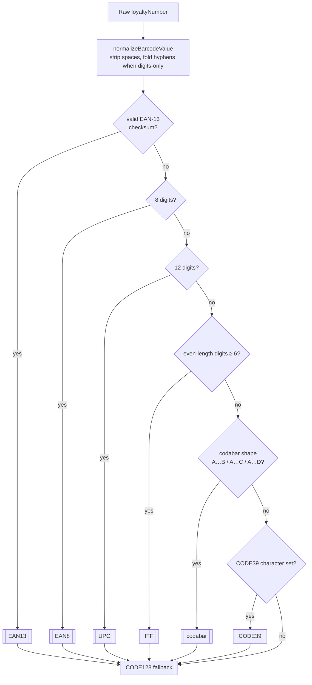

# Feature — Barcode display

Render a scannable barcode on the card detail page and, when possible,
automatically brighten the screen so checkout scanners can read it.

## Goal

Make the card detail page a drop-in replacement for presenting a physical
card at checkout — no manual "enable checkout mode" step, no failed scans
because the screen is too dim.

## Format detection chain

The loyalty number is rarely tagged with its format. `utils/barcodeFormats.ts`
picks the first format that *could plausibly encode* the normalised number,
preferring stricter / more widely-supported formats first:

`BarcodeDisplay` tries each candidate in order, catches `jsbarcode` failures,
and falls back to the next. If every format fails (for example: loyalty
*word* instead of a number), the component renders the number as text under a
short explanatory label — the cashier can still type it in.

## Brightness boost

On mount, `BarcodeDisplay` calls `utils/screenBrightness.ts`, which:

1. Feature-detects every supported brightness API (vendor-prefixed variants
   included).
2. Attempts a silent boost. On success, the result is held for the lifetime of
   the mount; on unmount, the original level is restored.
3. If the platform reports *unsupported* or the user rejects the request, the
   result is memoised so subsequent visits don't re-trigger prompts or
   log-spam.

Failure is invisible to the user — the barcode still renders at ambient
brightness. This is progressive enhancement, not a hard requirement.

## Accessibility

- The barcode `<svg>` has an accessible name built from the card name and
  normalised number.
- The readable number appears as a text node under the barcode, not embedded
  in the SVG — screen readers announce it, and *"long-press to copy"* works
  on mobile.
- The text fallback path uses the same DOM structure, so assistive tech isn't
  confused by two different trees.

## Files involved

| File                                   | Role                                     |
|----------------------------------------|------------------------------------------|
| `src/components/BarcodeDisplay.tsx`    | Renders SVG barcode + readable number    |
| `src/components/CardDetail.tsx`        | Hosts the component, decides when to render |
| `src/utils/barcodeFormats.ts`          | Normalisation, EAN-13 checksum, candidate list |
| `src/utils/screenBrightness.ts`        | Cross-browser brightness boost with memoisation |

## Edge cases

- **EAN-13 with a leading zero cut off by a form field.** `normalizeBarcodeValue`
  doesn't pad; the number is rejected from EAN-13 but still renders as
  CODE128.
- **Numbers with decorative hyphens** (`12345-67890-3`). Hyphens are stripped
  when the remainder is all digits and the total length is 8 / 12 / 13.
- **Long free-form numbers.** CODE128 handles up to 48 alphanumerics
  comfortably; beyond that, the barcode just becomes harder for scanners to
  read — no app-level limit.
- **Platforms without a Screen Brightness API.** The memoised *unsupported*
  result means we stop asking after the first visit.
