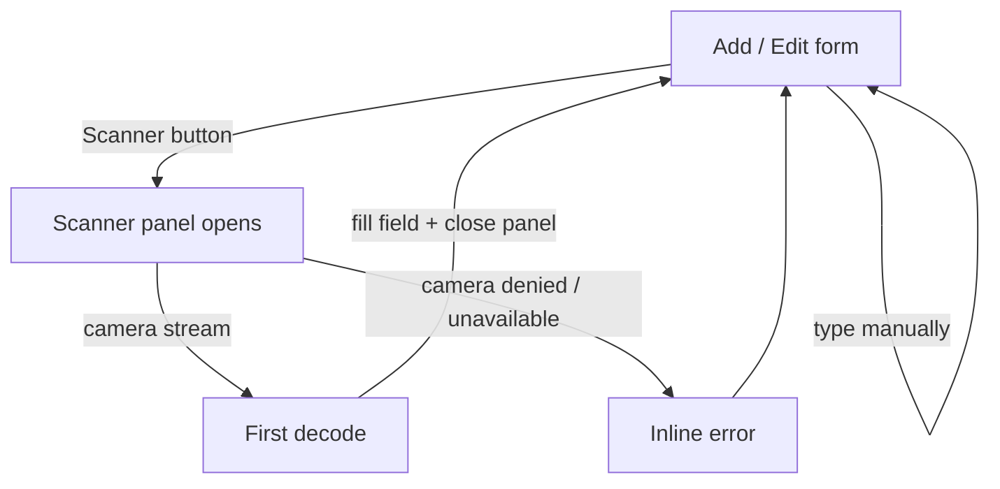

# Feature — Barcode scanner

Capture a loyalty number by pointing the rear camera at the physical card's
barcode, directly from the add/edit form.

## Goal

Remove the most error-prone step of onboarding a new card — manually typing a
13-digit number from a faded plastic strip.

## User flow

## Scope

- A "Scanner le code-barres" action in the card form.
- Rear-camera preference (`trackConstraints: { facingMode: 'environment' }`).
- First successfully decoded value populates `loyaltyNumber` and closes the
  scanner automatically.
- Green success chip ("Code détecté.") under the field on a successful scan.
- Inline, non-blocking error message when the camera can't be used.

## Non-goals

- Scanning outside the form flow (e.g. scan-to-search in the wallet).
- QR codes or 2D barcodes.
- Storing scan metadata (raw format, confidence).
- Re-entering the scanner automatically on failure.

## Files involved

| File                                   | Role                                     |
|----------------------------------------|------------------------------------------|
| `src/components/BarcodeScannerPanel.tsx` | Wraps `react-barcode-scanner`, owns open/closed state and error surface |
| `src/components/CardForm.tsx`          | Hosts the panel, wires the decoded value into the field |

## Engine

Uses `react-barcode-scanner@4`, which is backed by `zbar-wasm`. The
`zbar-inlined` Vite condition (see
[`technical-choices.md`](../technical-choices.md#react-barcode-scanner--inline-zbar-wasm))
is set so the wasm ships inside the bundle — the scanner works on the first
open after PWA install, no extra network round-trip.

## Edge cases

- **Camera permission denied.** The error message states the problem; manual
  entry still works. No retry loop.
- **No camera on the device** (desktop browser without a webcam, older
  hardware). Same path as permission denied.
- **Insecure origin.** Browsers expose `getUserMedia` only on secure contexts.
  Same error message — this is on the ops side to fix, not the user.
- **Ambiguous / noisy scan.** We take the *first* decoded value the library
  returns and close the panel. The user can immediately edit the field if the
  capture was wrong.
- **Scanner opened then dismissed.** No loyalty number is written; the field
  keeps whatever the user typed before opening the panel.
