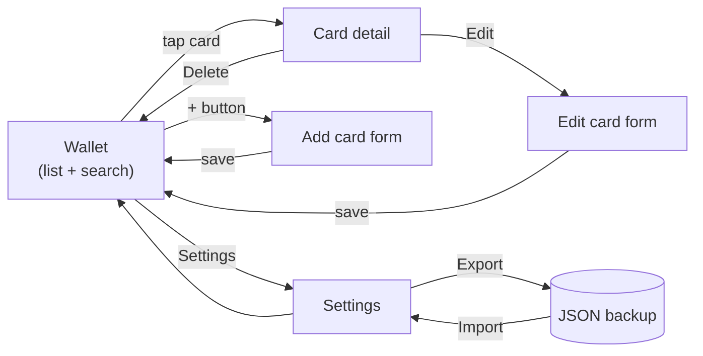

# Feature — Card management

CRUD for loyalty cards: add, edit, search, view, delete, plus logo handling
and backup/restore.

## Goal

Replace plastic cards with a locally-persisted wallet that can be navigated,
searched, and restored on another device without any server.

## User flow

## Scope

- Add / edit / delete cards with name, loyalty number, optional logo, accent
  colour, and note.
- List cards in alphabetical order (French locale).
- Search cards by name — accent- and case-insensitive.
- Empty state invitation when the wallet has no cards.
- Logo upload from file or URL, with dominant-colour extraction used as the
  default accent.
- Full-wallet JSON backup / restore (version 1).

## Non-goals

- Barcode scanning or rendering (covered by separate features).
- Activation zones (covered by [GPS activation](./gps-activation.md)).
- Rewards / offers / transactions.
- Cross-device sync.

## Files involved

| File                                   | Role                                     |
|----------------------------------------|------------------------------------------|
| `src/App.tsx`                          | View state, CRUD dispatch, search filter |
| `src/components/CardPreview.tsx`       | Row in the wallet list                   |
| `src/components/CardForm.tsx`          | Shared add / edit form                   |
| `src/components/CardDetail.tsx`        | Detail screen (barcode + zones embedded) |
| `src/components/EmptyState.tsx`        | First-run invitation                     |
| `src/components/AppHeader.tsx`         | Navigation controls                      |
| `src/storage/cardsStorage.ts`          | Load / save / backup / parse             |
| `src/utils/cardFormatting.ts`          | Input normalisation (trimming, etc.)     |
| `src/utils/imageProcessing.ts`         | File/URL → data URL + dominant colour    |
| `src/utils/createId.ts`                | UUID factory                             |
| `src/types.ts`                         | `LoyaltyCard`, `LoyaltyCardInput`        |

## Edge cases

- **Save failure (quota, disabled storage).** `saveCards` returns a failure
  result; the UI surfaces a persistent message until the next successful save.
- **Logo URL that fails to fetch.** The form keeps already-entered data and
  shows an inline error next to the logo picker. Submission is not blocked.
- **Search with non-ASCII characters.** Both the query and each card name are
  normalised via `toLocaleLowerCase('fr-FR')` before `includes` matching.
- **Corrupted `localStorage` payload.** Invalid entries are silently skipped
  by `loadCards()`'s validator chain. A wallet that had 10 cards and one
  corrupted record loads as 9 cards, not as empty.
- **Import of a backup with unknown fields.** Unknown fields on `cards[]` or
  `icons[]` fail the import entirely — no partial restore.
