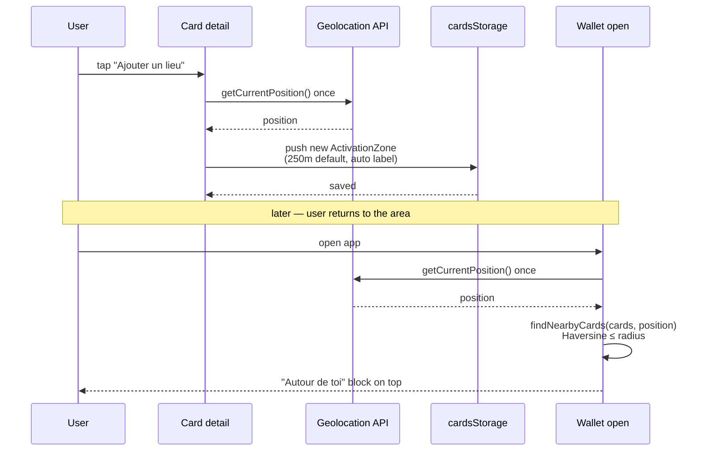

# Feature — GPS activation zones

Surface the right cards at the right time by pinning each card to one or more
geographic zones. When the device is inside a zone, the matching cards float
to the top of the wallet.

## Goal

Turn the wallet from a passive list into a context-aware shortcut. When you
arrive at your usual supermarket, the relevant card should be one tap away —
without any server-side geofencing, background tracking, or place search.

## User flow



## Scope

- Attach / rename / resize / delete zones, from the card detail page only.
- Preset radii: 50 m, 100 m, 250 m (default), 500 m.
- Auto-generated labels (*Lieu 1*, *Lieu 2*, …) that the user can edit.
- Mini Leaflet map displaying all of a card's zones as circles.
- "Autour de toi" section in the wallet, listing matching cards sorted by
  distance to their closest matching zone.
- "Nearby unavailable" section at the bottom of the wallet when location is
  denied / unsupported, with a retry button.

## Non-goals

- Continuous background tracking (`watchPosition`).
- Server-side or cross-device zone storage.
- Address or place search / reverse geocoding.
- Manual lat/lng entry.
- Polygon zones.
- Offline map tile caching.

## Data model

```ts
type ActivationZone = {
  id: string;
  label: string;            // trimmed, non-empty
  latitude: number;         // [-90, 90]
  longitude: number;        // [-180, 180]
  radiusMeters: number;     // > 0
  createdAt: string;        // ISO
  updatedAt: string;        // ISO
};
```

Attached to a card via the optional `activationZones` array on `LoyaltyCard`.
See [data-model.md](../data-model.md).

## Matching

`utils/geo.ts`'s `findNearbyCards(cards, position)`:

1. For each card, walk its zones.
2. Compute the Haversine distance from `position` to each zone's centre.
3. Keep the zone with the *smallest* distance where `distance ≤ radiusMeters`.
4. Return one entry per card that has at least one matching zone, sorted by
   distance ascending.

This runs synchronously on every new position or wallet update — O(cards ×
zones) per pass, which is trivial at user-realistic sizes.

## Files involved

| File                                              | Role                                     |
|---------------------------------------------------|------------------------------------------|
| `src/App.tsx`                                     | Triggers `requestPosition` on wallet mount when zones exist; renders nearby section |
| `src/components/NearbyCardsSection.tsx`           | Presentation of the matching cards       |
| `src/components/ActivationZonesPanel.tsx`         | Zone list + controls on the detail page  |
| `src/components/ActivationZonesMap.tsx`           | Leaflet map with zone circles            |
| `src/hooks/useCurrentPosition.ts`                 | One-shot geolocation with state machine  |
| `src/utils/geo.ts`                                | Haversine distance, `findNearbyCards`    |
| `src/types.ts`                                    | `ActivationZone`                         |

## Leaflet / OpenStreetMap integration

- `react-leaflet` 5, `leaflet` 1.9.
- Tiles: standard OSM tile server, with attribution rendered in the map widget.
- No zooming, no heavy interactivity by default — the map is a read-mostly
  overview.
- Tiles are fetched on demand; there is no prefetching or offline cache.

## Edge cases

- **User denies permission.** State transitions to `denied`; wallet renders the
  retry block at the bottom. No nagging re-prompt.
- **Device without GPS / secure context missing.** `unsupported` / `unavailable`
  — same behaviour as denied.
- **Timeout (10 s).** Same as `unavailable`.
- **Card inside multiple overlapping zones.** Only the *closest* matching zone
  contributes to the ranking; the card appears once.
- **Very tight radius (< 30 m) on consumer-grade GPS.** Low-accuracy fix
  (`enableHighAccuracy: false`) may fail to enter the circle even when the
  user is physically at the spot. Document expectation; no in-app mitigation.
- **Zone at extreme latitudes / antimeridian.** Haversine handles both
  correctly; tested in `src/utils/geo.test.ts`.
